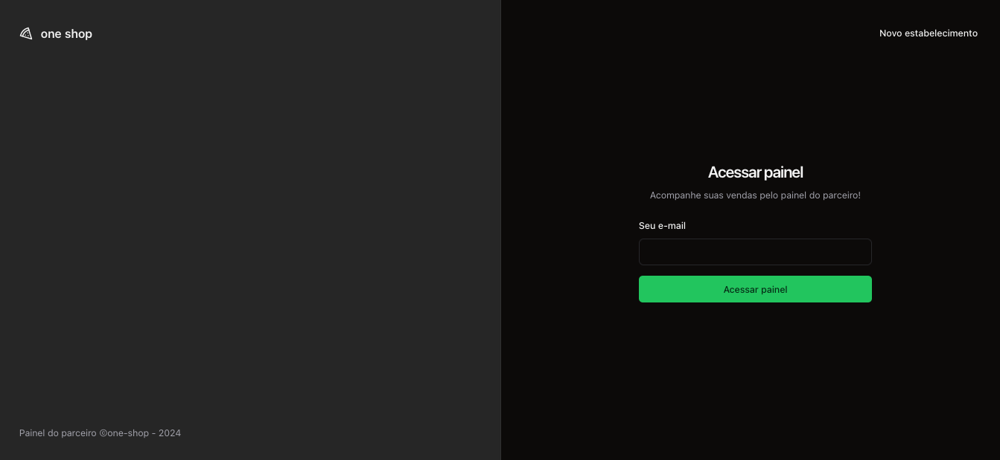
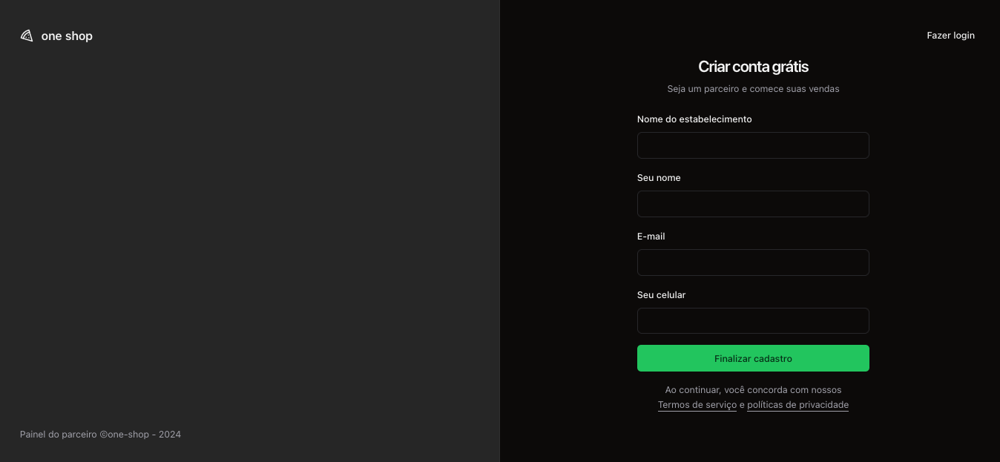
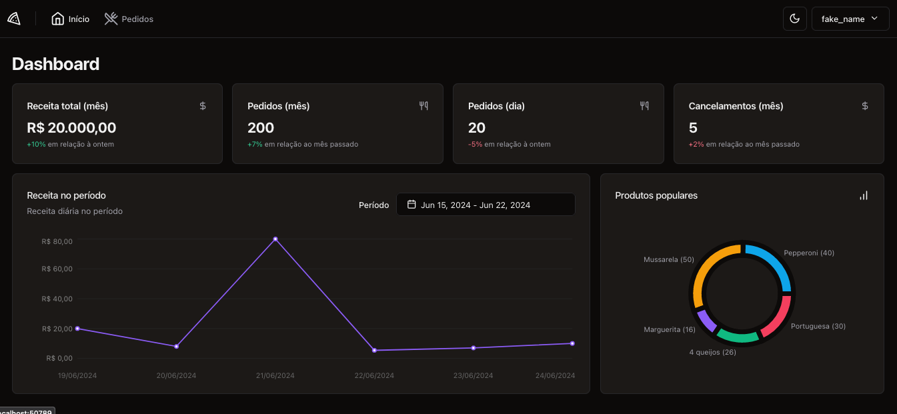
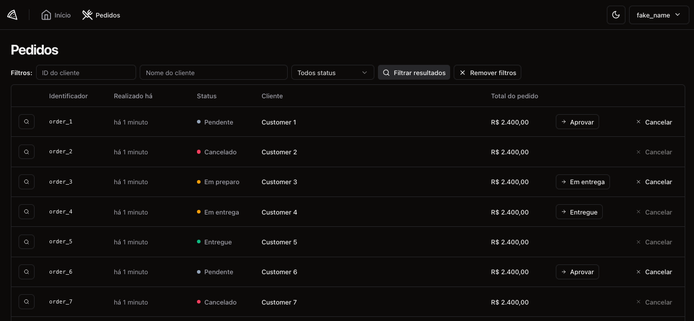
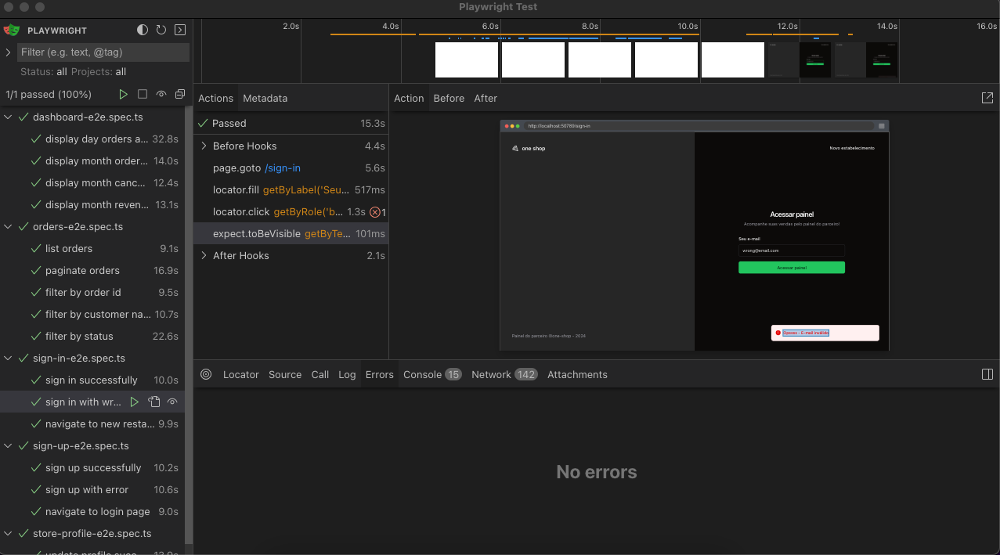
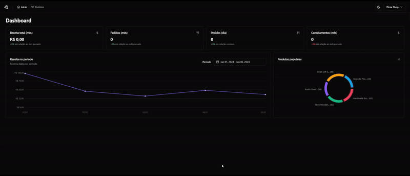

<h1 align="center">
  One shop
</h1>
## Aplicativo de gestão de um estabelecimento (bar, restaurante, lanchonete).

**Introdução**

Este aplicativo web permite que você faça a gestão do estabelecimento e controle de pedidos estilo iFood.

**Tecnologias:**

- [ReactJS](https://pt-br.reactjs.org)
- [Typescript](https://www.typescriptlang.org)
- [Tailwindcss](https://tailwindcss.com)-
- [React Hook Form](https://react-hook-form.com)
- [Zod](https://zod.dev)
- [Shadcn/ui](https://ui.shadcn.com/)
- [Recharts](https://recharts.org/en-US/)
- [Vitest](https://vitest.dev/)
- [Playwright](https://playwright.dev/)

**Demonstração:**

<p align="center">
  
  
  
  
  
  
</p>

**Instalação e Execução:**

1.  Clone o repositório:

Bash

```
git clone https://github.com/Gui-dev/one-shop.git

```

2.  Rode a API:

Bash

```
bun install
```

Bash

```
bun dev
```

3.  Execute a aplicação web:

Bash

```
npm run dev
```

```
pnpm dev
```

5.  Acesse a aplicação em http://localhost:3000 no seu navegador.

**Contribuição:**

Agradecemos a sua contribuição para este projeto! Você pode contribuir submetendo issues e pull requests no repositório GitHub.

**Licença:**

Este projeto está licenciado sob a licença MIT.
